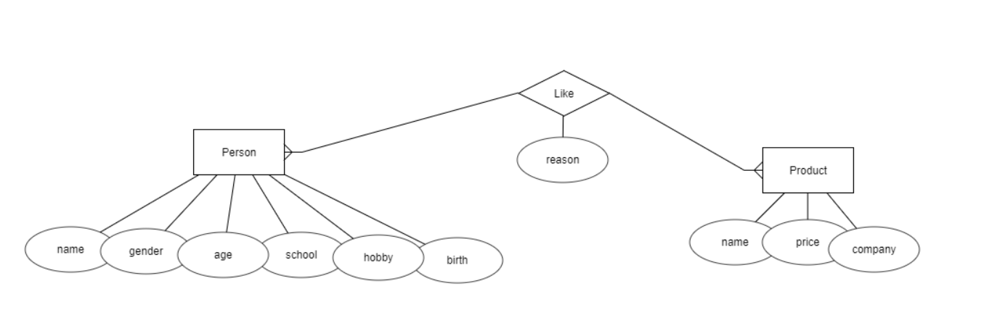
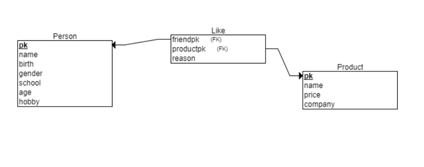

# 데이터베이스 튜터링
===================

2017.11.09 일곱번째

> 이론에 질문이 있으면 해주세요

### 데이터베이스 설계 방법에 대한 정리

> 개념적 설계와 물리적 설계의 차이는 간단하다. 
> **개념적 설계**는 데이터 들의 **관계** 를 정하는 것이고 
> **논리적 설계**는 데이터 들의 **관계를 테이블로** 표현하는 것이고 
> **물리적 설계**는 데이터 들의 **저장형태** 를 정하는 것이다.

E:Entity *개체*, R:Relation *관계*, A:Attribute *속성*

#### ER 설계 방법
1. 요구 사항 분석 => 요구사항 명세서
    1. 데이터베이스를 실제로 사용하는 사용자읨 범위 결정
    2. 사용자가 조직에서 수행하는 업무를 분석
    3. 면담, 설문 조사, 업무 고나련 문서 분석 등의 방법을 이용해 요구사항 수집
    4. 수집된 요구 사항에 대한 분석 결과를 요구 사항 명세서로 작성
2. 개념적 설계 => ER다이어그램
    1. 개체 추출, 각 개체의 주요 속성과 키 속성 선별
    2. 개체 간의 관계 결정
    3. ER다이어그램으로 표현
3. 논리적 설계 => 릴레이션 스키마
    1. ER다이어그램을 릴레이션 스키마로 표현한다. 몇 가지 규칙을 준수한다
        - 모든 개체는 릴레이션으로 변환한다
        - 다대다 관계는 릴레이션으로 변환한다
        - 일대다 관계를 외래키로 표현한다
        - 일대일 관계는 외래키로 표현한다
        - 다중값 속성은 릴레이션으로 변환한다
        - 기타 고려사항으로는 개체가 자신과 관계를 맺는 경우, 기본 규칙을 그대로 적용한다.
4. 물리적 설계 => 물리적 스키마
    1. 하드웨어나 운영체제의 특성을 고려하여 필요한 인덱스 구조나 내부 저장구조 등에 대한 물리적 구조를 설계한다.
5. 구현 => 완성
    1. SQL로 작성한 명령문을 DBMS에서 실행하여 데이터베이스를 실제로 생성한다.

#### 정규화를 이용한 설계(이상 현상을 제거하면서 데이터 베이스를 올바르게 설계해 나가는 과정)

> 함수 종속성을 이용해 릴레이션을 연관성이 있는 속성들로만 구성되도록 분해해서 이상현상이 발생하지 않는 바람직한 릴레이션으로 만들어가는 과정
> 정규화를 통해 릴레이션은 무손실 분해(nonloss decomposition)되어야한다.

1. 이상현상 : 불필요한 데이터 중복으로 인해 릴레이션에 대한 데이터 삽입, 수정, 삭제 연산을 수행할 때 발생 할 수 있는 부작용
    1. 삽입 이상 : 새 데이터를 삽입하기 위해 불필요한 데이터도 함께 삽입해야하는 문제
    2. 갱신 이상 : 중복 튜플 중 일부만 변경하여 데이터가 불일치 하게 되는 모순의 문제
    3. 삭제 이상 : 튜플을 삭제하면 꼭 필욯나 데이터까지 함께 삭제되는 데이터 손실의 문제
2. 함수종속 : 이상현상이 발생하지 않도록 릴레이션을 관련 있는 속성들로만 구성하기 위해 릴레이션을 분해(decomposition)하는 과정, 함수의 종속성을 판단하여 정규화한다.
    1. X->Y 표기법 : **"X가 Y를 함수적으로 결정한다."**
        - 릴레이션 내의 튜플을 대상으로 하나의 X값에 대한 Y값이 항상 하나임
        - X와 Y는 하나의 릴레이션을 구성하는 속성들의 부분집합
        - 완전 함수 종속(FFD)
            - 릴레이션에서 속성 집합 Y가 속성 집합 X에 함수적으로 종속되어 있지만, 속성 지합 X의 전체가 아닌 일부분에는 종속되지 않음을 의미
            - 일반적으로 함수 종속은 완전 함수 종속을 의미한다
        - 부분 함수 종속(PFD)
            - 릴레이션에서 속성 집합 Y가 속성 집합 X의 전체가 아닌 일부분에도 함수적으로 종속됨을 의미
    2. 함수 종속 다이어그램 : 함수 종속을 표현한 것
3. 정규형(NF;Normal Form) : 릴레이션이 정규화된 정도이다. 각 정규형 마다 제약 조건이 존재한다. 릴레이션의 특성을 고려하여 적합한 정규형을 선택한다.
    1. 제1정규형
        - 릴레이션의 모든 속성이 더는 분해되지 않는 원자 값만 가지는 형태
        - 데이터 베이스 릴레이션이 될 자격이 있음, 이상이 또 있는 경우는 부분 함수 종속 이므로, 릴레이션을 분해하여 완전 함수 종속으로 만든다.(제2 정규형)
    2. 제2정규형
        - 릴레이션이 제 1정규형에 속하고, 기본키가 아닌 모든 속성이 기본키에 **완전 함수 종속 되면 제 2정규형**을 만족한다.
        - 이행적 함수 종속이 존재하면, 릴레이션 내의 겹치는 종속 관계가 발생, 이행적 함수 종속이 제거되도록 릴레이션을 분해한다.(제 3정규형)
    3. 제3정규형
        - 릴레이션이 제 2정규형에 속하고, 기본키가 아닌 모든 속성이 기본키에 **이행적 함수 종속되지 않으면 제 3 정규형**을 만족한다.
    4. 보이스/코드 정규형(강한 형태의 제3 정규형)
        - 하나의 릴레이션에 여러 개의 후보키가 존재하는 경우, 제 3정규형까지 모두 만족해도 이상현상이 발생할 수 있다.
        - 릴레이션의 함수 종속 관계에서 모든 결정자가 후보키이면, 보이스/코드 정규형에 속한다.
    5. 제4정규형
        - 릴레이션이 보이스/코드 정규형을 만족하면서, 함수 종속이 아닌 다치 종속(MVD)를 제거하면 제 4정규형에 속함
    6. 제5정규형
        - 릴레이션이 제 4정규형을 만족하면서, 후보키를 통하지 않는 조인 종속을 제거하면 제 5 정규형에 속함

    > 모든 릴레이션이 제 5 정규형에 속해야만 바람직한 것은 아님
    > 일반적으로 제 3 정규형이나 보이스/코드 정규형에 속하도록 릴레이션을 분해하여 데이터 중복을 줄이고 이상현상을 해결하는 경우가 많음

### 예제 순서대로 해보기

간단한 예를 들어서 설명을 하자면, 내가 만들고 싶은 데이터베이스는 이렇다. 좀 더 복잡한 예제는 원하시면 준비해보겠습니당

> 친구의 생일 선물을 챙겨주기 위해 친구들이 좋아하는 상품(음료수, 과자 등등)들과 좋아하는 이유를 관리하는 데이터베이스를 만들고 싶다.

###### 1. 요구사항 분석(요구사항 명세서)
처음에 개체와 관계를 찾아낸다.
> 친구의 생일 선물을 챙겨주기 위해 **친구**들이 좋아하는 **상품(음료수, 과자 등등)**들과 좋아하는 이유를 관리하는 데이터베이스를 만들고 싶다.

친구와 상품이라는 개체가 필요하고, 친구와 상품사이에는 좋아한다라는 관계가 있다는 것을 알 수 있다. 또, 정해진 관계에서 친구에게는 이름, 나이, 생일 등의 속성이 필요할 것으로 예상되고, 상품은 이름과 가격, 판매하는 회사의 속성이 필요하다. 좋아한다라는 관계에서도 그 이유라는 속성을 필요로 하고 있다.

이를 따라서 내가 정한 속성은
- 친구 : 이름, 성별, 나이, 학교, 취미, 생일
- 상품 : 이름, 가격, 판매사
- 좋아한다(상품-친구) : 이유

로 정했고, 이를 요구사항 명세서로 만들어보면,
1. 친구는 이름, 성별, 나이, 학교, 취미, 생일이라는 정보를 가지고 있다.
2. 상품은 이름, 가격, 판매사라는 정보를 가지고 있다.
3. 친구와 상품은 좋아한다는 관계를 가지고 있고, 그 이유가 필요하다.

###### 2. 개념적 설계(ERD)
위의 요구조건 명세를 바탕으로 개념적 설계를 해보면, 결과물은 ERD의 형태로 나타난다. 위의 명세를 ERD로 표현한다면 아래의 그림으로 표현할 수 있다.

간단하게 설명하면 요구사항 명세서의 1.에 의해서 친구를 Person 으로 표현했고, 2.에 의해서 상품을 Product로 표현했다. 그리고 좋아하는 관계는 Like으로 표현하고 속성으로 좋아하는 이유인 reason을 표현했다.
   

###### 3. 논리적 설계(릴레이션 스키마)
이제 논리적 설계를 해보자. 처음은 무조건 일대일 관계로 두고 생각한다. **사람의 입장**에서 여러 상품을 좋아할 수 있지 않을까? 맞다면, 일대다 관계를 가지게되고, **상품의 입장**에서 좋아하는 사람이 여러명이 될 수 있을까? 가 맞으면 일대다이므로 서로가 일대다 관계이면 다대다 관계라고 생각하면 된다. 독점의 가능 여부로 생각해 보면 편할 수 있다.

관계와 개체의 속성들을 종합한 결과물로 릴레이션 스키마를 위의 그림처럼 표현할 수 있다. 서로의 관계에 대한 테이블인 Like는 다대다 관계이므로 따로 나눠서 표현을 했고, 관계에 연관된 개체 두개의 fk로 하나의 pk처럼 식별한다.   

###### 4. 물리적 설계 - 데이터베이스 구현
논리적 설계가 완성이 되었으면 물리적 테이블로 변환하자, 물리적 설계에서는 각 컬럼의 데이터의 형태를 어떻게 저장할지를 정하는 것이다. 그리고 운영체제 및 특성에 따라서 어떤 데이터베이스를 저장할지, 인덱스를 어떻게 사용할지에 대해서 지정한다.

|pk|이름|성별|나이|학교|취미|생일|
|:--:|:--:|:--:|:--:|:--:|:--:|:--:|
|int|varchar(10)|varchar(1)|int|varchar(10)|varchar(20)|date|

|pk|이름|가격|판매사|
|:--:|:--:|:--:|:--:|
|int|varchar(20)|int|varchar(20)|

|친구ID|상품ID|이유|
|:--:|:--:|:--:|
|int|int|varchar(200)|

위의 결과물 처럼 나왔고, 실제 데이터베이스 구현은 이를 SQL문으로 만들어서 실행시키면 완성이되게 된다.
